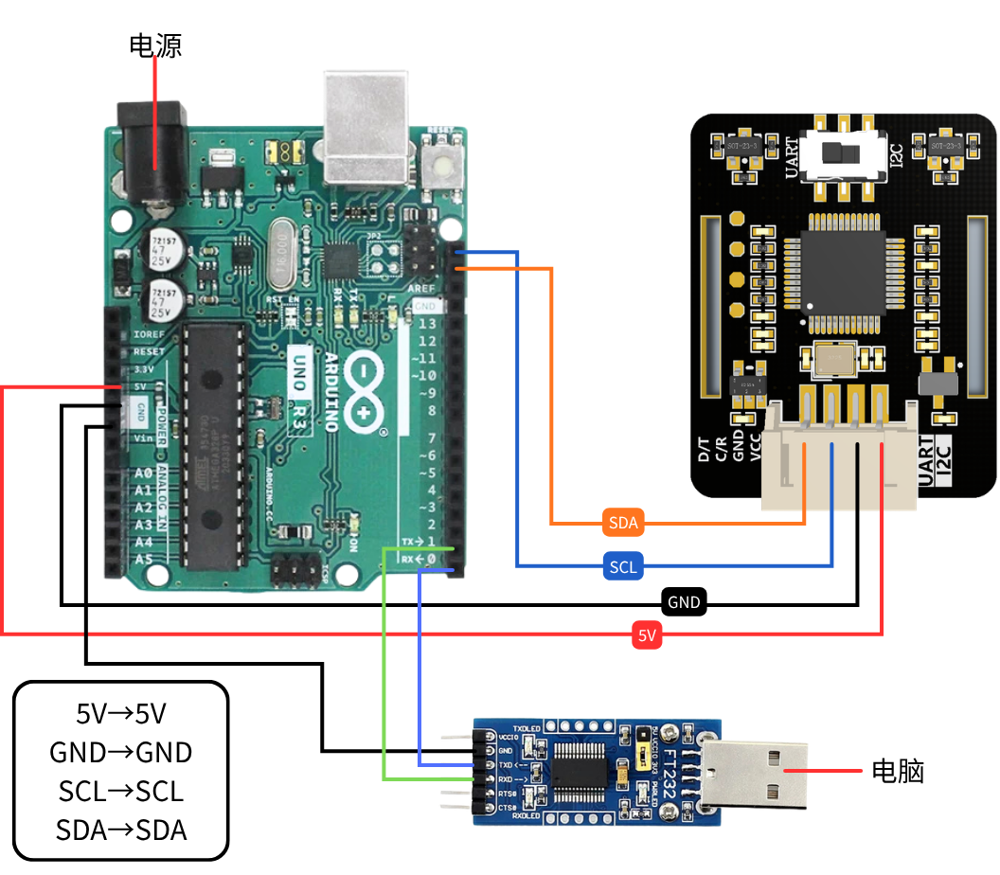
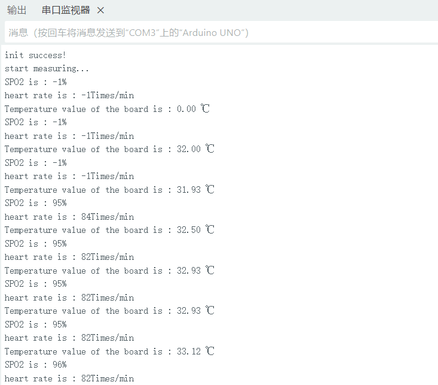
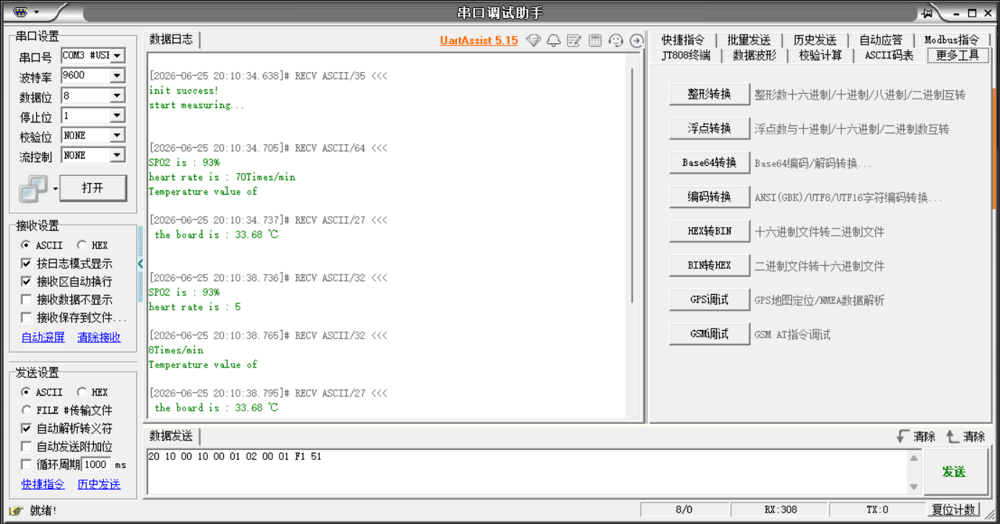

[English](../../en/01-arduino/README.md) | [Deutsch](../../de/01-arduino/README.md) | [Español](../../es/01-arduino/README.md) | [Français](../../fr/01-arduino/README.md) | [Italiano](../../it/01-arduino/README.md) | [日本語](../../ja/01-arduino/README.md) | [한국어](../../ko/01-arduino/README.md) | [Português (BR)](../../pt-br/01-arduino/README.md) | [Português (PT)](../../pt-pt/01-arduino/README.md) | [简体中文](../../zh-hans/01-arduino/README.md) | 繁體中文

# JUXI_HeartRate_SPO2 心率血氧感測器使用教學

## 目錄
1. [感測器簡介](#感測器簡介)
2. [Arduino 使用教學](#arduino-使用教學)
3. [Python (树莓派) 使用教學](#python-树莓派-使用教學)
4. [常見問題](#常見問題)

---

## 感測器簡介

JUXI_HeartRate_SPO2 是一款基於 MAX30102 晶片的心率血氧感測器模組，內建演算法可直接輸出心率和血氧飽和度數值。

**主要功能：**

- 血氧飽和度（SPO2）測量
- 心率測量（次/分鐘）
- 板載溫度測量
- 支援 I2C 通訊方式

---

## Arduino 使用教學

### 1. 硬體準備

| 所需材料 |
|---------|
| Arduino 開發板（Uno/Nano/ESP32等） |
| JUXI_HeartRate_SPO2 感測器 |
| 杜邦線若干 |
| USB資料線（Arduino連接到電腦上） |

### 2. 函式庫安裝

1. 下載本函式庫檔案
2. 將 `JUXI_HeartRate_SPO2` 資料夾複製到 Arduino 函式庫目錄：
   - Windows: `C:\Users\用户名\Documents\Arduino\libraries\`
   - Mac: `~/Documents/Arduino/libraries/`
   - Linux: `~/Arduino/libraries/`
3. 重新啟動 Arduino IDE

### 3. 範例程式碼

**注意上傳程式碼時，只連接Arduino 到電腦上，Arduino不連接心率血氧監測模組！！！**

```cpp
#include "JUXI_HeartRate_SPO2.h"

// I2C 地址
#define I2C_ADDRESS 0x57

// 创建传感器对象，I2C模式
JUXI_HeartRate_SPO2_I2C sensor(&Wire, I2C_ADDRESS);

void setup() {
  Serial.begin(9600);

  // 初始化传感器
  while (!sensor.begin()) {
    Serial.println("传感器初始化失败，请检查连接！");
    delay(1000);
  }
  Serial.println("传感器初始化成功！");

  // 启动数据采集
  sensor.sensorStartCollect();
}

void loop() {
  // 读取心率和血氧数据
  sensor.getHeartbeatSPO2();

  // 输出血氧饱和度
  Serial.print("血氧饱和度: ");
  Serial.print(sensor._sHeartbeatSPO2.SPO2);
  Serial.println(" %");

  // 输出心率
  Serial.print("心率: ");
  Serial.print(sensor._sHeartbeatSPO2.Heartbeat);
  Serial.println(" 次/分钟");

  // 读取并输出温度
  Serial.print("板载温度: ");
  Serial.print(sensor.getTemperature_C());
  Serial.println(" ℃");

  Serial.println("------------------------");

  // 传感器每4秒更新一次数据
  delay(4000);
}
```

##### 硬體連接

I2C 通訊

| 感測器接腳 | Arduino |
| ---------- | ------- |
| VCC        | 5V/3.3V |
| GND        | GND     |
| SDA        | SDA/A4  |
| SCL        | SCL/A5  |




- 將心率血氧監測模組撥片撥動到IIC！！！
- 使用資料線將Arduino連接到電腦上

#### 執行結果：

1、開啟 Arduino-工具-序列埠監視器

​	設定鮑率為9600



2、開啟序列埠除錯助手

[序列埠除錯助手uartassist5.15.zip](https://juxitech.feishu.cn/wiki/BJlfwSQydi7u5lkRDQ6cV4dvnBd)

選擇序列埠號

設定鮑率為`9600`

資料位`8`，停止位`1`，校驗位`NONE`，流控制`NONE`

接受設定和傳送設定選擇`ASCII`



### 4. API 說明

| 函式 | 說明 |
|-----|------|
| `begin()` | 初始化感測器，返回 true/false |
| `getHeartbeatSPO2()` | 讀取心率和血氧資料，儲存在 `_sHeartbeatSPO2` 結構體中 |
| `getTemperature_C()` | 讀取板載溫度（攝氏度） |
| `sensorStartCollect()` | 開始資料採集（感測器亮燈） |
| `sensorEndCollect()` | 停止資料採集（感測器關燈） |

### 5. 資料說明

- **SPO2（血氧飽和度）**: 正常範圍 95% - 100%，值為 -1 表示無效
- **Heartbeat（心率）**: 正常範圍 60 - 100 次/分鐘，值為 -1 表示無效
- **無效值原因**: 手指未放置好或資料未穩定

---

## 使用注意事項

### 測量技巧

1. **正確放置手指**
   - 將手指輕輕放在感測器上，覆蓋兩個LED燈
   - 不要用力按壓，以免影響血液循環
   - 保持手指穩定，不要移動

2. **等待資料穩定**
   - 剛開始測量時，數值可能不穩定
   - 建議等待 10-30 秒，待資料穩定後再讀取
   - 感測器每 4 秒更新一次資料

3. **環境要求**
   - 避免強光直射感測器
   - 保持環境溫度適宜
   - 測量時保持安靜

### 資料解讀

| SPO2 範圍 | 說明 |
|----------|------|
| 95% - 100% | 正常 |
| 90% - 94% | 輕度低氧 |
| < 90% | 低氧，建議就醫 |

| 心率範圍 | 說明 |
|---------|------|
| 60 - 100 次/分 | 成人正常範圍 |
| < 60 次/分 | 心動過緩 |
| > 100 次/分 | 心動過速 |

---

## 常見問題

### Q1: 感測器初始化失敗怎麼辦？

**A:**

1. 檢查接線是否正確（SDA接GPIO2/A4，SCL接GPIO3/A5）
2. 確認電源是否正常（3.3V或5V）
3. 使用 `i2cdetect -y 1` 命令檢測設備
4. 確認感測器撥片在 IIC 位置

### Q2: 資料一直顯示 -1 怎麼辦？

**A:**
1. 確認手指已正確放置在感測器上
2. 等待幾秒鐘讓資料穩定
3. 檢查是否已呼叫 `sensorStartCollect()` 開啟採集
4. 確認感測器指示燈是否亮起

### Q3: 資料不準確怎麼辦？

**A:**
1. 確保手指完全覆蓋感測器光學區域
2. 保持手指靜止，不要移動
3. 等待 30 秒以上讓資料穩定
4. 多次測量取平均值

### Q4: 感測器支援哪些 Arduino 開發板？

**A:** 支援：
- Arduino Uno/Nano/Mega
- ESP8266
- ESP32
- 其他支援 Arduino 環境的開發板

---

## 範例檔案位置

### Arduino 範例
```
JUXI_HeartRate_SPO2/
└── examples/
    └── gainHeartbeatSPO2/
        └── gainHeartbeatSPO2.ino
```


